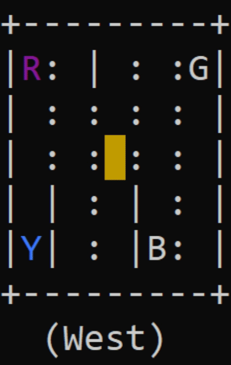

# taxidriver_ai
A reinforcement learning taxi driver agent.

Here is a 5-by-5 grid world inhabited by a taxi agent. There are four specially-designated locations in
this world, marked as R(ed), B(lue), G(reen), and Y(ellow). The taxi problem is episodic. In
each episode, the taxi starts in a randomly-chosen square. There is a passenger at one of the
four locations (chosen randomly), and that passenger wishes to be transported to one of the four
locations (also chosen randomly). The taxi must go to the passenger’s location (the “source”), pick
up the passenger, go to the destination location (the “destination”), and put down the passenger
there. (To keep things uniform, the taxi must pick up and drop off the passenger even if he/she
is already located at the destination!) The episode ends when the passenger is deposited at the
destination location.
There are six primitive actions in this domain: (a) four navigation actions that move the taxi
one square North, South, East, or West, (b) a Pickup action, and (c) a Putdown action. Each action
is deterministic. There is a reward of −1 for each action and an additional reward of +20 for
successfully delivering the passenger. There is a reward of −10 if the taxi attempts to execute the
Putdown or Pickup actions illegally. If a navigation action would cause the taxi to hit a wall, the
action is a no-op, and there is only the usual reward of −1.
We seek a policy that maximizes the total reward per episode. There are 500 possible states:
25 squares, 5 locations for the passenger (counting the four starting locations and the taxi), and 4
destinations.
